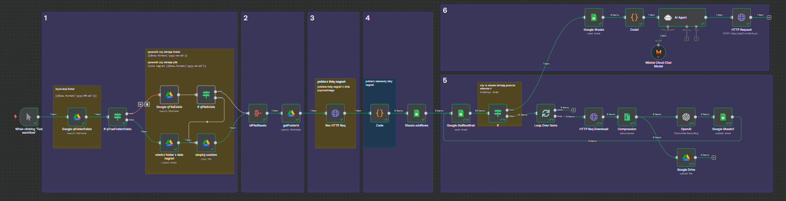

# n8n+Nagrywarka+MultiInfo+AI

# n8n Narywarka Multiinfo PLUS

### Przepływ  n8n




Możesz pobrać plik JSON tego przepływu pracy [tutaj](recPlk_gh.json) i zaimportować go do swojej instancji n8n.

---

## 1. Trigger: “When clicking ‘Test workflow’”

**Node typu:** `manualTrigger`
**Opis:**

* Wyzwala cały workflow w momencie ręcznego uruchomienia (kliknięcie „Test workflow”).
* Stanowi punkt startowy, dzięki któremu n8n wie, że ma rozpocząć kolejne kroki.


---

## 2. Sprawdzanie istnienia folderu z datą: “Google qFolderExists”

**Node typu:** `googleDrive` (operacja `fileFolder` → `queryString`)
**Parametry kluczowe:**

* `queryString`: dzisiejsza data w formacie YYYY-MM-DD
* `folderId`: ID głównego folderu „RecPLK” w Google Drive (tam trzymamy wszystkie foldery z nagraniami)

**Opis:**

* Node wyszukuje folder o nazwie równej dzisiejszej dacie (np. „2025-06-01”) wewnątrz folderu „RecPLK”.
* Jeśli folder o takiej nazwie istnieje, zwraca jego ID w polu `id`.
* Jeśli nie istnieje, zwraca puste wyniki, co przechwyci kolejny węzeł typu IF.

---

## 3. Warunek: “If qTrueFolderExists”

**Node typu:** `if`
**Parametry kluczowe:**

* Sprawdzanie, czy w poprzednim węźle (`Google qFolderExists`) pole `id` istnieje (czy zostało zwrócone).

**Opis:**

* Gdy warunek jest prawdziwy (`true` → folder istnieje), przechodzimy do węzła „Google qFileExists” (zobaczyć punkt 5).
* Gdy warunek jest `false` (folder nie istnieje), idziemy do sekcji „utwórz folder z datą nagrań” (punkt 4).

---

## 4. Tworzenie folderu dnia: “utwórz folder z datą nagrań”

**Node typu:** `googleDrive` (operacja `folder` → `name`)
**Parametry kluczowe:**

* `name`: ciąg znaków z dzisiejszą datą `{{$now.format('yyyy-MM-dd')}}` (np. „2025-06-01”)
* `driveId`: „My Drive”
* `folderId`: ID głównego folderu „RecPLK” (rodzic, w którym utworzymy nowy folder)

**Opis:**

* Node tworzy nowy folder w Google Drive o nazwie odpowiadającej bieżącej dacie wewnątrz katalogu „RecPLK”.
* W efekcie dostajemy strukturę:

  ```
  RecPLK
  ├─ 2025-05-30
  ├─ 2025-05-31
  └─ 2025-06-01 ← NOWY FOLDER
  ```
---

## 5. Kopiowanie szablonu arkusza: “skopiuj szablon”

**Node typu:** `googleDrive` (operacja `copy`)
**Parametry kluczowe:**

* `fileId`: ID szablonu Google Sheets (plik o nazwie „lista nagrań SZABLON”)
* `name`: nowa nazwa pliku, np. „lista nagrań 2025-06-01”

**Opis:**

* Node kopiuje gotowy szablon arkusza (z nagłówkami kolumn: `calledNr`, `dataCzas`, `recNr`, `recID`, `treść`) i nadaje mu nazwę z datą.
* Plik zostaje umieszczony w folderze głównym „My Drive” (w domyślnej lokalizacji).
* W kolejnym kroku będziemy dodawać do niego wiersze z listą nagrań.
---

## 6. Sprawdzenie istnienia pliku: “Google qFileExists”

**Node typu:** `googleDrive` (operacja `fileFolder` → `queryString`)
**Parametry kluczowe:**

* `queryString`: „lista nagrań YYYY-MM-DD” (np. „lista nagrań 2025-06-01”)
* `filter.whatToSearch`: `files`
* `driveId`: „My Drive”

**Opis:**

* Node sprawdza, czy w „My Drive” istnieje już plik o nazwie „lista nagrań ⟨data⟩”.
* Jeżeli tak – przejdziemy do węzła `idFileSheets` (punkt 7), żeby pobrać jego `id` i kontynuować.
* W przeciwnym razie znowu idziemy do węzła „skopiuj szablon” – choć fizycznie, dzięki połączeniom warunkowym, „skopiuj szablon” wykona się tylko raz, jeśli nie istniał plik.
---

## 7. Agregacja ID pliku Sheets: “idFileSheets”

**Node typu:** `aggregate` (operacja `aggregateAllItemData`)
**Parametry kluczowe:**

* `destinationFieldName`: `IdFileSheetListRec`
* Zbiera wszystkie elementy wyjściowe z poprzedniego węzła „Google qFileExists” lub „skopiuj szablon” i zwraca tablicę z wynikami, w której każdy zawiera m.in. `id` pliku arkusza.

**Opis:**

* Node agreguje dane, bo wcześniejsze węzły mogły zwrócić jeden lub więcej rekordów (np. jeśli plik istnieje kilka kopii).
* Wynik to tablica w polu `IdFileSheetListRec`, której pierwszy element ma klucz `.id` – to ID arkusza, którego będziemy używać w kolejnych krokach (dodawanie wierszy, aktualizacja transkrypcji, itp.).

---

## 8. Pobranie ID folderu z nagraniami: “getFolderId”

**Node typu:** `googleDrive` (operacja `fileFolder` → `queryString`)
**Parametry kluczowe:**

* `queryString`: ta sama data YYYY-MM-DD (np. „2025-06-01”)
* `filter.folderId`: ID folderu „RecPLK”

**Opis:**

* Ten node ponownie wyszukuje folder o nazwie równiej dacie, tym razem po to, aby pobrać jego `id` i umieścić rozpakowane pliki mp3 właśnie w tym subfolderze.
* Efekt: w polu `.id` pojawia się ID folderu „RecPLK/2025-06-01”.
---

## 9. Pobranie listy nagrań: “Rec HTTP Req”

**Node typu:** `httpRequest`
**Parametry kluczowe:**

* `url`: `https://nagrywanie.plus.pl/recordingApi/recordingsPaged/`
* Nagłówki / autoryzacja: dane do logowania HTTP Basic (credential `RecVPBX example.user@example.com`)
* Query params:

  * `status=RECORDED`
  * `dateFrom={{ $now.minus({days: 1}).startOf('day').format("yyyy-MM-dd'T'HH:mm:ss") }}` → lista nagrań od początku wczoraj (cały dzień poprzedni)

**Opis:**

* Node wysyła zapytanie do API Nagrywarka PLUS, aby pobrać listę wszystkich nagrań (`status=RECORDED`) z dnia poprzedniego (użycie `$now.minus({days: 1}).startOf('day')`).
* Otrzymujemy paged response (stronicowany JSON), w którym w polu `content` mamy tablicę obiektów opisujących każde nagranie (np. `recId`, `recordingNumber`, `calledUserPart`, `establishedTime`).
---

## 10. Parsowanie odpowiedzi: “Code”

**Node typu:** `code` (JavaScript)
**Parametry kluczowe (kod JS):**

```js
const inputItemJson = $input.first().json;
const contentArray = inputItemJson.content;
const extractedItems = [];
if (Array.isArray(contentArray)) {
  for (const item of contentArray) {
    extractedItems.push({
      json: {
        calledNr: item.calledUserPart,
        dataCzas: item.establishedTime,
        recNr: item.recordingNumber,
        recID: item.recId
      }
    });
  }
}
return extractedItems;
```

**Opis:**

* Node pobiera odpowiedź z „Rec HTTP Req”, przechodzi przez tablicę `content` i wyciąga cztery kluczowe pola:

  * `calledNr` (numer dzwoniącego)
  * `dataCzas` (data i czas nawiązania połączenia)
  * `recNr` (wewnętrzny numer nagrania)
  * `recID` (unikalny identyfikator nagrania)
* Tworzy nową tablicę elementów w formacie, który akceptuje n8n – każdy element to obiekt `json` z powyższymi polami.
---

## 11. Dodawanie wierszy do arkusza: “Sheets addRows”

**Node typu:** `googleSheets` (operacja `appendOrUpdate`)
**Parametry kluczowe:**

* `documentId`: `={{ $('idFileSheets').item.json.IdFileSheetListRec[0].id }}` → ID arkusza pobrane w węźle „idFileSheets”
* `sheetName`: `gid=0` (pierwszy arkusz w pliku; nazwa „listaREC”)
* `columns.mappingMode`: `defineBelow`
* `value`: obiekt mapujący:

  * `calledNr`: `={{ $json.calledNr }}`
  * `dataCzas`: `={{ $json.dataCzas }}`
  * `recNr`: `={{ $json.recNr }}`
  * `recID`: `={{ $json.c }}`
  * `treść`: `"brak"` (domyślnie wstawiamy „brak”, bo jeszcze nie mamy transkrypcji)
* `matchingColumns`: `["recID"]` (`recID` Kolumna używana podczas dopasowywania wierszy w Arkuszach Google do elementów wejściowych tego węzła)

**Opis:**

* Dla każdego elementu wyjściowego z poprzedniego node’a (kod JS) dodajemy nowy wiersz do arkusza:

  1. Jeśli w arkuszu już jest wiersz z danym `recID`, to aktualizujemy jego wartości (mechanizm `appendOrUpdate`).
  2. Jeśli nie – wstawiamy nowy wiersz.
* Kolumna `treść` na razie ma wartość `"brak"`. W kolejnych krokach sprawdzimy, czy są wiersze z `"brak"` w tej kolumnie, żeby pobrać transkrypcję.

---

## 12. Pobranie wierszy bez transkrypcji: “Google GetRowBrak”

**Node typu:** `googleSheets` (operacja `filtersUI`)
**Parametry kluczowe:**

* `documentId`: ID tego samego arkusza
* `sheetName`: `gid=0`
* `filtersUI.values`: filtry: `lookupColumn: "treść"`, `lookupValue: "brak"`

**Opis:**

* Node pobiera wszystkie wiersze, w których kolumna `treść` ma wartość `"brak"`.
* Dzięki temu wiemy, które nagrania wymagają jeszcze pobrania pliku mp3 i transkrypcji.
* Wynik to lista wierszy (z danymi `calledNr`, `dataCzas`, `recNr`, `recID`, `treść: "brak"`).

---

## 13. Warunek: “If” (czy istnieją wiersze z treścią=”brak”)

**Node typu:** `if`
**Parametry kluczowe:**

* `leftValue`: `={{ $json.recID }}`
* Operator: `notExists` (czy `recID` nie istnieje?–nie, to sprawdza, czy mamy puste recID? Jednak w praktyce warunek dopuszcza przejście do pętli, jeśli są wiersze do przetworzenia)

**Opis:**

* Sprawdza, czy jest przynajmniej jeden wiersz z kolumną `treść` równą `"brak"`.
* Jeśli tak (warunek `true`), przechodzi do węzła “Loop Over Items” (pętla pobierania i przetwarzania plików).
* Jeśli nie (warunek `false` – nie ma nagrań do transkrypcji), workflow kończy się (nie podjęto węzła w gałęzi `false`).

---

## 14. Pętla: “Loop Over Items”

**Node typu:** `splitInBatches` (parametr `executeOnce=false`, `alwaysOutputData=true`)
**Parametry kluczowe:**

* Dzieli listę wierszy z poprzedniego węzła (Google GetRowBrak) na pojedyncze elementy, które będą przetwarzane kolejno (batch size domyślnie 1).

**Opis:**

* Każdy „batch” to jeden wiersz, czyli jedno nagranie (`recID`).
* Dla każdego elementu (wiersza) pętla wywoła węzeł “HTTP Req Download” (punkt 15).
* Po zakończeniu pętli (ostatni batch) workflow wróci do warunku „If” i do węzła “Google Sheets” (punkt 17), by ocenić dalsze kroki (choć w danym flow trafimy tu tylko raz).

---

## 15. Pobranie pliku nagrania: “HTTP Req Download”

**Node typu:** `httpRequest`
**Parametry kluczowe:**

* `url`: `https://nagrywanie.plus.pl/recordingApi/recording/{{ $json.recID }}` (pobiera plik audio po `recID`)
* Autoryzacja: HTTP Basic (to samo konto Nagrywarka PLUS)
* Brak dodatkowych query parameters

**Opis:**

* Node wysyła request do Nagrywarka PLUS, aby pobrać plik audio (.zip lub binarny blob) odpowiadający `recID`.
* Odpowiedź to plik binarny (zazwyczaj skompresowany), który trafia do właściwości binarnej `binary.data`.
* Następnie przechodzimy do node’a „Compression” (rozpakowanie).

---

## 16. Rozpakowanie pliku: “Compression”

**Node typu:** `compression`
**Parametry kluczowe:**

* `outputPrefix`: `=rec` (nazwy rozpakowanych plików będą zaczynać się od „rec”)

**Opis:**

* Node rozpakowuje plik zip (lub inny format paczki) i zwraca pliki mp3 w polu `binary` (np. `binary.rec0`, `binary.rec1` itd.).
* W praktyce większość nagrań to pojedynczy plik mp3, więc uzyskamy `binary.rec0` zawierający audio.

---

## 17. Transkrypcja audio: “OpenAI”

**Node typu:** `@n8n/n8n-nodes-langchain.openAi` (operacja `transcribe`)
**Parametry kluczowe:**

* `resource`: `audio`
* `operation`: `transcribe`
* `binaryPropertyName`: `=rec0` (pliki mp3 z węzła „Compression”)
* `options.language`: `"pl"` (język polski)
* `credentials`: konto OpenAI (API key)

**Opis:**

* Node wysyła plik mp3 do modelu OpenAI, który wykonuje transkrypcję mowy na tekst.
* W efekcie uzyskujemy w polu `json.text` całą transkrypcję rozmowy w formie ciągu znaków (ciąg PL).

---

## 18. Zapis pliku mp3 na Google Drive: “Google Drive”

**Node typu:** `googleDrive` (operacja `upload` domyślna)
**Parametry kluczowe:**

* `inputDataFieldName`: `rec0` (mp3 z węzła „Compression”)
* `name`: `={{ $json.dataCzas }}-{{ $json.recID }}` (np. „2025-05-31T14:30:00-abc123”)
* `driveId`: „My Drive”
* `folderId`: `={{ $('getFolderId').item.json.id }}` (ID folderu „RecPLK/YYYY-MM-DD”)

**Opis:**

* Node przesyła rozpakowany plik mp3 do odpowiedniego folderu w Google Drive (folderu z datą).
* Nazwa pliku to połączenie daty i `recID`, co ułatwia identyfikację i późniejsze odwołania.

---

## 19. Aktualizacja arkusza transkrypcją: “Google Sheets1”

**Node typu:** `googleSheets` (operacja `update`)
**Parametry kluczowe:**

* `documentId`: ID arkusza (taki sam jak w „idFileSheets”)
* `sheetName`: `gid=0`
* `columns.mappingMode`: `defineBelow`
* `value`:

  * `treść`: `={{ $json.text }}` (transkrypcja z „OpenAI”)
  * `recID`: `={{ $('Loop Over Items').item.json.recID }}` (żeby ustalić, który wiersz aktualizować)
* `matchingColumns`: `["recID"]`

**Opis:**

* Dla każdego wiersza (nagrania) aktualizujemy kolumnę `treść`, wpisując otrzymaną transkrypcję.
* Mechanizm `matchingColumns` porównuje `recID` z kolumną w arkuszu i nadpisuje wartość w kolumnie `treść`.

---

## 20. Pobranie wszystkich transkrypcji: “Google Sheets”

**Node typu:** `googleSheets` (operacja `getAllRows` domyślna)
**Parametry kluczowe:**

* `documentId`: ID arkusza
* `sheetName`: `gid=0`

**Opis:**

* Pobiera wszystkie wiersze z arkusza (po wstawieniu transkrypcji).
* Wynik to tablica obiektów JSON, w których każdy element zawiera klucz `treść` z transkrypcją.

---

## 21. Ekstrakcja samych transkrypcji do tablicy: “Code1”

**Node typu:** `code` (JavaScript)
**Parametry kluczowe (kod JS):**

```js
const treść = items.map(item => item.json['treść']);
return [{ json: { treść } }];
```

**Opis:**

* Node iteruje po wszystkich wierszach, zbiera wartość z pola `treść` i tworzy tablicę (`treść`) zawierającą same teksty wszystkich rozmów.
* Rezultat to jeden obiekt JSON, w którym znajduje się klucz `treść` → np. `["tekst rozmowy 1", "tekst rozmowy 2", ...]`.

---

## 22. Ocena sentymentu: “AI Agent” (+ “Mistral Cloud Chat Model”)

**Node typu:** `@n8n/n8n-nodes-langchain.agent`
**Parametry kluczowe:**

* `promptType`: `define`
* `text`: `={{ $json['treść'] }}` (tablica transkrypcji)
* `systemMessage`:

  ```
  Otrzymujesz tablicę z nagraniami rozmów telefonicznych w formie tekstowej:
  ["tekst rozmowy 1", "tekst rozmowy 2", ..., "tekst rozmowy N"].

  Na podstawie treści ocen ton i emocje rozmówców. W 3–4 zdaniach podsumuj ogólny sentyment tych rozmów, używając określeń:
  przyjazny, miły, neutralny, sfrustrowany, nieprzyjemny.

  Skup się na ogólnym wrażeniu z całego dnia. Nie podawaj analizy pojedynczych rozmów.
  ```
* Źródło modelu AI:

  * `Mistral Cloud Chat Model` (węzeł `lmChatMistralCloud` jako `ai_languageModel`)
* Credential: konto Mistral Cloud

**Opis:**

* Node uruchamia model językowy Mistral, przekazując mu tablicę transkrypcji i systemową instrukcję, aby wygenerować krótki, 3–4-zdaniowy summary z oceną nastroju rozmów.
* Ocena sentymentu powinna zawierać konkretne etykiety: „przyjazny”, „miły”, „neutralny”, „sfrustrowany”, „nieprzyjemny”.
* Rezultat to pole `json.output`, np.:

  > „Dzisiaj rozmówcy byli w większości przyjaźni i uprzejmi, ale kilka połączeń miało nieco sfrustrowany ton. Ogólnie trwała neutralna, profesjonalna wymiana, chociaż w kilku momentach dało się wyczuć napięcie.”
---

## 23. Wysłanie SMS z podsumowaniem: “HTTP Request”

**Node typu:** `httpRequest`
**Parametry kluczowe:**

* `method`: `POST`
* `url`: `https://api2.multiinfo.plus.pl/Api61/sendsmslong.aspx`
* Query params:

  * `dest`: numer docelowy SMS (np. `48601XXXXXX`)
  * `text`: `={{ $json.output }}` (tekst wygenerowany przez AI Agent)
  * `login`: `example.user.multiinfo`
  * `password`: `abcd`
  * `serviceId`: `XXXXX`
  * `advancedEncoding`: `true`

**Opis:**

* Skonfigurowany request do Multiinfo PLUS – usługi SMS-owej.
* Wysyła krótki, jednorazowy SMS z podsumowaniem sentymentu rozmów na wskazany numer telefonu.
* Dzięki `advancedEncoding=true` obsługujemy poprawnie polskie znaki diakrytyczne.

---

## Dodatkowe uwagi i wnioski

1. **Struktura folderów i plików (Google Drive)**

   * Główna lokalizacja: `RecPLK`
   * Podfoldery: każda data w formacie `YYYY-MM-DD`, do których trafiają pliki mp3.
   * Każdy plik mp3 nazywa się `data-recID.mp3`, co ułatwia identyfikację.

2. **Arkusz Google (Sheets)**

   * Szablon arkusza zawiera kolumny: `calledNr`, `dataCzas`, `recNr`, `recID`, `treść`.
   * Pierwotnie kolumna `treść` ma wartość `"brak"`, a później zostaje zastąpiona transkrypcją.
   * Dostęp do arkusza posiadają odpowiednie credentials (użytkownik `example.user@gmail.com`).

3. **Usługi PLUS**

   * **Nagrywarka PLUS**: API służące do pobierania listy nagrań (`recordingsPaged`) i pobierania konkretnych plików audio (`recording/{recID}`).
   * **Multiinfo PLUS**: API umożliwiające wysyłanie SMS-ów (`sendsmslong.aspx`), wykorzystywane do przesłania menedżerowi krótkiego podsumowania.

4. **AI i transkrypcja**

   * Transkrypcja audio → tekst realizowana przez OpenAI (node `OpenAI`).
   * Analiza sentymentu wykonywana przy pomocy modelu Mistral węzła `Mistral Cloud Chat Model` + `AI Agent`.

5. **Zastosowania w praktyce**

   * Workflow idealnie sprawdza się w B2B telekomie:

     * Automatyczne archiwizowanie nagrań.
     * Generowanie raportów dziennych (znacznie oszczędzając czas zespołu).
     * Szybki feedback sentymentalny, wysyłany SMS-em do kierownika projektu.
   * Dodatkowa korzyść: pełna przejrzystość i ścieżka audytu – każdy krok zapisany w Google Drive + Google Sheets.

---

